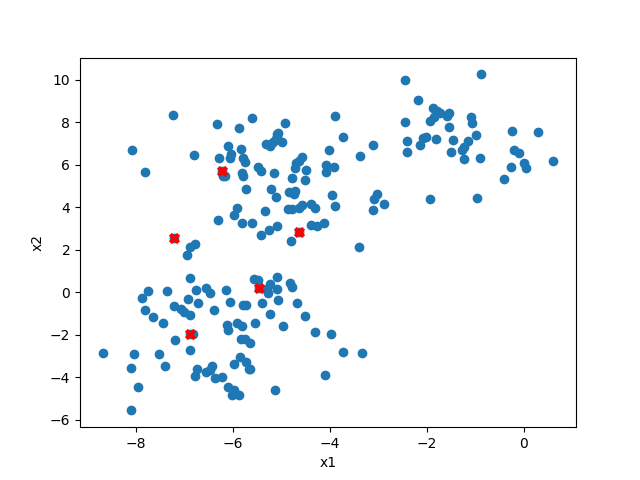
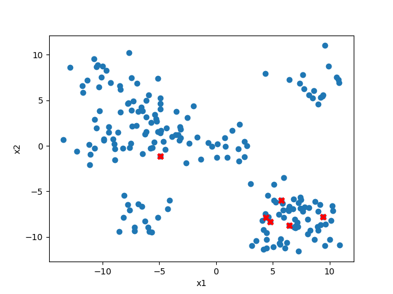

# K-Means
*My implementation of the k-means algorithm.*

## Built with

[PyCharm](https://www.jetbrains.com/pycharm/) - *The IDE used*

# Animations

Two .gif animations that I made, that showcase how the algorithm first chooses the initial centroids and then updates their locations. The animations also show how the data points change what cluster they are assigned to via colors.

